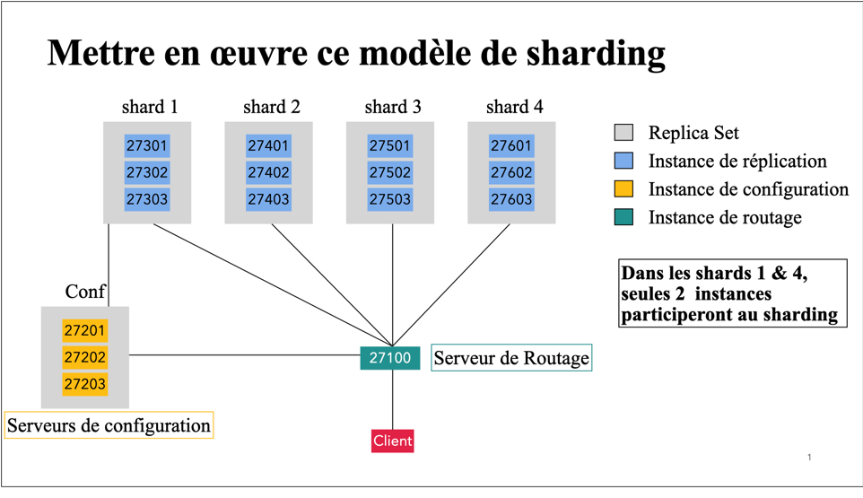

# Groupe9: Projet d'implementation d'un modele de sharding

## Description du Projet

Ce projet consiste en la mise en place d'un modèle de sharding pour MongoDB, afin de démontrer l'efficacité de ce modèle pour gérer de grandes quantités de données. Nous avons utilisé Docker pour créer un environnement virtuel afin de configurer et tester notre cluster MongoDB avec sharding.



## Technologies Utilisées

- MongoDB : Base de données NoSQL.
- Docker : Conteneurisation des services MongoDB.
- Docker Compose : Orchestration des conteneurs Docker.

## Instructions d'Utilisation

1. Configuration des Config Servers
   Connectez-vous au conteneur du serveur de configuration et initialisez le replica set :

```bash
docker exec -it group9_nosql-configsvr1-1 mongosh --port 27201 admin
```

```javascript
rs.initiate({
  _id: "confReplSet",
  configsvr: true,
  members: [
    { _id: 0, host: "group9_nosql-configsvr1-1:27201" },
    { _id: 1, host: "group9_nosql-configsvr2-1:27202" },
    { _id: 2, host: "group9_nosql-configsvr3-1:27203" },
  ],
});
```

2. Configuration des Shards
   Initialisez les replica sets pour chaque shard :

### Shard 1 :

```bash
docker exec -it group9_nosql-shard1_1-1 mongosh --port 27301 admin
```

```javascript
rs.initiate({
  _id: "shard1",
  members: [
    { _id: 0, host: "group9_nosql-shard1_1-1:27301" },
    { _id: 1, host: "group9_nosql-shard1_2-1:27302" },
    { _id: 2, host: "group9_nosql-shard1_3-1:27303" },
  ],
});
```

### Shard 2 :

```bash
docker exec -it group9_nosql-shard2_1-1 mongosh --port 27401 admin
```

```javascript
rs.initiate({
  _id: "shard2",
  members: [
    { _id: 0, host: "group9_nosql-shard2_1-1:27401" },
    { _id: 1, host: "group9_nosql-shard2_2-1:27402" },
    { _id: 2, host: "group9_nosql-shard2_3-1:27403" },
  ],
});
```

### Shard 3 :

```bash
docker exec -it group9_nosql-shard3_1-1 mongosh --port 27501 admin
```

```javascript
rs.initiate({
  _id: "shard3",
  members: [
    { _id: 0, host: "group9_nosql-shard3_1-1:27501" },
    { _id: 1, host: "group9_nosql-shard3_2-1:27502" },
    { _id: 2, host: "group9_nosql-shard3_3-1:27503" },
  ],
});
```

### Shard 4 :

```bash
docker exec -it group9_nosql-shard4_1-1 mongosh --port 27601 admin
```

```javascript
rs.initiate({
  _id: "shard4",
  members: [
    { _id: 0, host: "group9_nosql-shard4_1-1:27601" },
    { _id: 1, host: "group9_nosql-shard4_2-1:27602" },
    { _id: 2, host: "group9_nosql-shard4_3-1:27603" },
  ],
});
```

### Reconfigurez le replica set et réalisez une élection :

```javascript
rs.reconfig({
  _id: "shard4",
  members: [
    { _id: 0, host: "group9_nosql-shard4_1-1:27601" },
    { _id: 1, host: "group9_nosql-shard4_2-1:27602" },
    { _id: 2, host: "group9_nosql-shard4_3-1:27603" },
  ],
});
```

```javascript
rs.stepDown(); // Election
```

3. Configuration du Mongos
   Ajoutez les shards au cluster :

```bash
docker exec -it group9_nosql-mongos-1 mongosh --port 27100
```

```javascript
sh.addShard("shard1/group9_nosql-shard1_1-1:27301,group9_nosql-shard1_2-1:27302") # deux instances participent
sh.addShard("shard2/group9_nosql-shard2_1-1:27401,group9_nosql-shard2_2-1:27402,group9_nosql-shard2_3-1:27403")
sh.addShard("shard3/group9_nosql-shard3_1-1:27501,group9_nosql-shard3_2-1:27502,group9_nosql-shard3_3-1:27503")
sh.addShard("shard4/group9_nosql-shard4_1-1:27601,group9_nosql-shard4_2-1:27602") # deux instances participent
```

4. Connexion au Cluster MongoDB

Connectez-vous au cluster MongoDB :

```bash
docker exec -it group9_nosql-mongos-1 mongosh --port 27100
```

5. Création d'une Nouvelle Base de Données
   Créez une nouvelle base de données et activez le sharding :

```bash
show dbs
use dit
sh.enableSharding("dit")
```

6. Création d'une Collection
   Créez une collection et configurez le sharding :

```bash
db.createCollection("students")
sh.shardCollection("dit.students", { matricule: "hashed" }, false, { "numInitialChunks": 1, "chunkSize": 10 })

db.students.insert({ name: 'John Doe', matricule: 1 })
show collections

sh.status()
```

# Conclusion

Ce projet nous a permis de mettre en œuvre un modèle de sharding dans MongoDB pour démontrer sa capacité à gérer de grandes quantités de données efficacement. Le sharding assure une meilleure scalabilité, une gestion optimisée de la réplication des données et une meilleure tolérance aux pannes. En utilisant Docker et Docker Compose, nous avons pu créer un environnement virtuel robuste pour tester notre configuration de sharding, tout en acquérant des compétences pratiques en conteneurisation et en orchestration.
